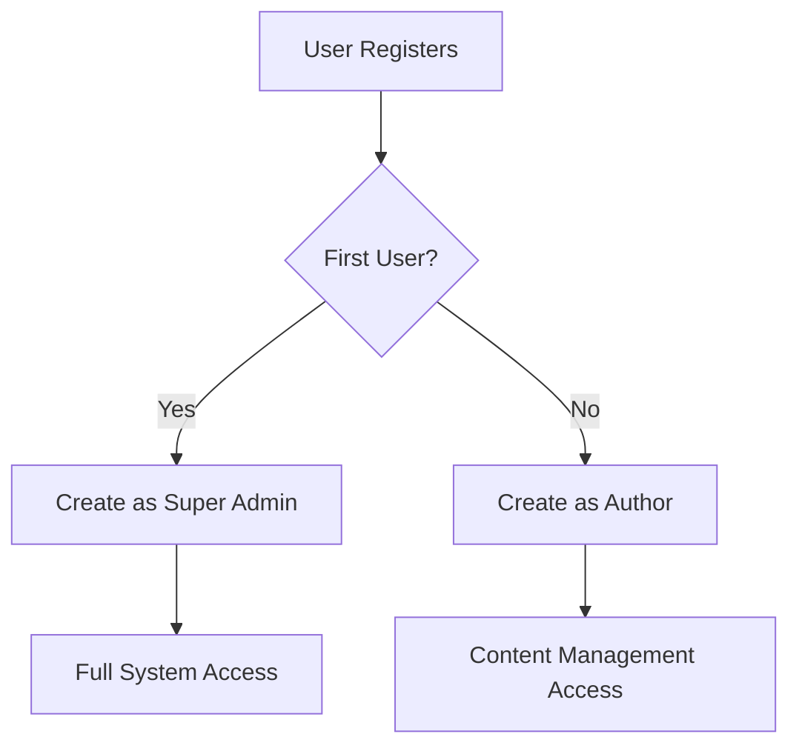

# Admin Registration Setup Guide

This guide#### ✅ **Allowed Actions:**

- **Blog Posts**: Create, Read, Update
- **Categories**: Create, Read, Update
- **Tags**: Create, Read, Update
- **Authors**: Create, Read, Update
- **Media Library**: Full image/file management
  - Upload images and files
  - Download and copy links
  - Update and organize media
  - Configure media library view

#### ❌ **Restricted Actions:**s how to use the admin registration feature for new content creators with superuser protection.

## Overview

The admin panel supports secure user registration with automatic role assignment:

- **First user** becomes **Super Admin** (only one allowed)
- **Subsequent users** become **Authors** with content management permissions
- **Super Admin** can promote users to Editor or keep them as Authors

## Superuser Protection

### How It Works

1. **First Registration**: Automatically becomes Super Admin
2. **Subsequent Registrations**: Become Authors only
3. **No Multiple Superusers**: System prevents creation of additional Super Admins through registration
4. **Role Promotion**: Only existing Super Admin can promote users to Editor or admin roles

### Registration Flow



## Configuration

### Environment Variables

Add to your `.env` file:

```env
# Enable admin registration (set to false to disable)
ADMIN_REGISTRATION_ENABLED=true
```

### Default Permissions

New users who register will automatically receive the "Author" role with these permissions:

#### ✅ **Author Role Capabilities:**

- **Content Management**: Can manage content they have created
- **Blog Posts**: Create, read, update, and publish their own posts
- **Media Library**: Upload and manage images for their content
- **Categories & Tags**: Use existing categories and tags for their posts

#### ❌ **Author Restrictions:**

- **Cannot edit other users' content**: Only their own posts
- **Cannot create categories or tags**: Can only use existing ones
- **Cannot delete content**: No delete permissions
- **Cannot manage users**: No access to user management
- **Cannot access system settings**: No admin configuration access
- **Cannot manage API tokens**: No token creation or management

## Using Registration

### For New Users:

1. **Access the admin panel**: Go to `http://localhost:1337/admin`
2. **Click "Need an account? Create one here"** on the login page
3. **Fill out registration form**:
   - First Name
   - Last Name
   - Email Address
   - Password
4. **Submit** and you'll be automatically logged in with Author permissions

### For Administrators:

1. **Monitor new registrations** in the admin panel under Settings > Roles & Permissions
2. **Promote users to Editor** by editing their roles (Super Admin only)
3. **Manage Author permissions** by modifying the role
4. **Disable registration** by setting `ADMIN_REGISTRATION_ENABLED=false` in production

### Superuser Management:

1. **First user becomes Super Admin** automatically
2. **Only one Super Admin** can exist through registration
3. **Super Admin can promote Authors to Editors** or create additional admins
4. **Authors cannot self-promote** or access admin functions

## Security Considerations

### Development vs Production

**Development:**

```env
ADMIN_REGISTRATION_ENABLED=true
```

**Production:**

```env
ADMIN_REGISTRATION_ENABLED=false  # Recommended for security
```

### Best Practices

1. **Disable in Production**: Only enable registration during content team onboarding
2. **Monitor Registrations**: Regularly review new user accounts
3. **Role Management**: Periodically audit user permissions
4. **Email Verification**: Consider implementing email verification for production use

## Role Management

### Viewing Content Creator Role

1. Go to **Settings > Roles & Permissions**
2. Click on **"Content Creator"** role
3. Review permissions under **"Content Manager"** section

### Customizing Permissions

To modify what Content Creator users can do:

1. **Edit the role** in Settings > Roles & Permissions
2. **Add/Remove permissions** as needed
3. **Save changes** - affects all users with this role

### Creating Additional Roles

You can create specialized roles like:

- **"Editor"** - Can publish/unpublish content
- **"Author"** - Can only manage their own posts
- **"Moderator"** - Can manage comments and user content

## Troubleshooting

### Registration Not Available

1. **Check environment variable**: Ensure `ADMIN_REGISTRATION_ENABLED=true`
2. **Restart Strapi**: Changes require a server restart
3. **Clear browser cache**: Force refresh the admin page

### Permission Issues

1. **Verify role assignment**: Check user has "Content Creator" role
2. **Review role permissions**: Ensure role has correct permissions
3. **Check content types**: Verify API names match in permissions

### Bootstrap Errors

If you see errors during startup about role creation:

1. **Check logs**: Look for specific error messages
2. **Database permissions**: Ensure Strapi can write to database
3. **Clean restart**: Stop Strapi, clear cache, restart

## Customization

### Custom Welcome Messages

The registration page uses these translations (in `src/admin/app.tsx`):

```typescript
'Auth.form.register.title': 'Join NodeWave',
'Auth.form.register.subtitle': 'Create your content creator account',
'Auth.link.signup': 'Need an account? Create one here',
```

### Adding More Permissions

To give Content Creators additional permissions, edit `/src/admin/bootstrap/roles.js`:

```javascript
const subjects = [
  'api::blog-post.blog-post',
  'api::category.category',
  'api::tag.tag',
  'api::author.author',
  'api::your-new-content-type.your-new-content-type', // Add new content types
]
```

### Email Notifications

Consider implementing email notifications when new users register:

1. **Admin notification**: Alert when someone registers
2. **Welcome email**: Send new users a welcome message
3. **Account approval**: Require admin approval for new accounts

This setup provides a secure, controlled way for content creators to join your blog management team while maintaining proper access control.
